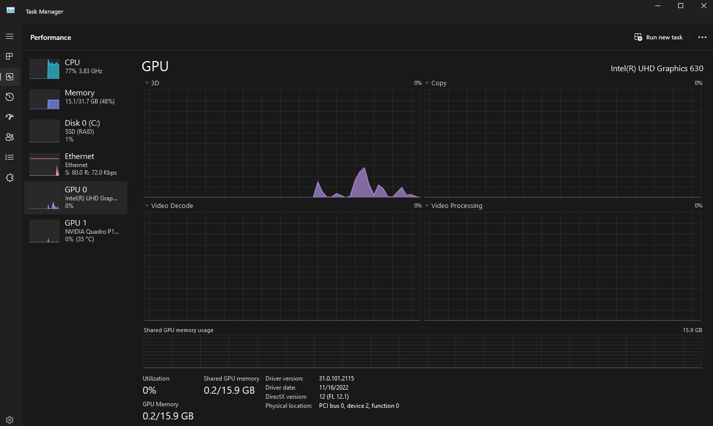
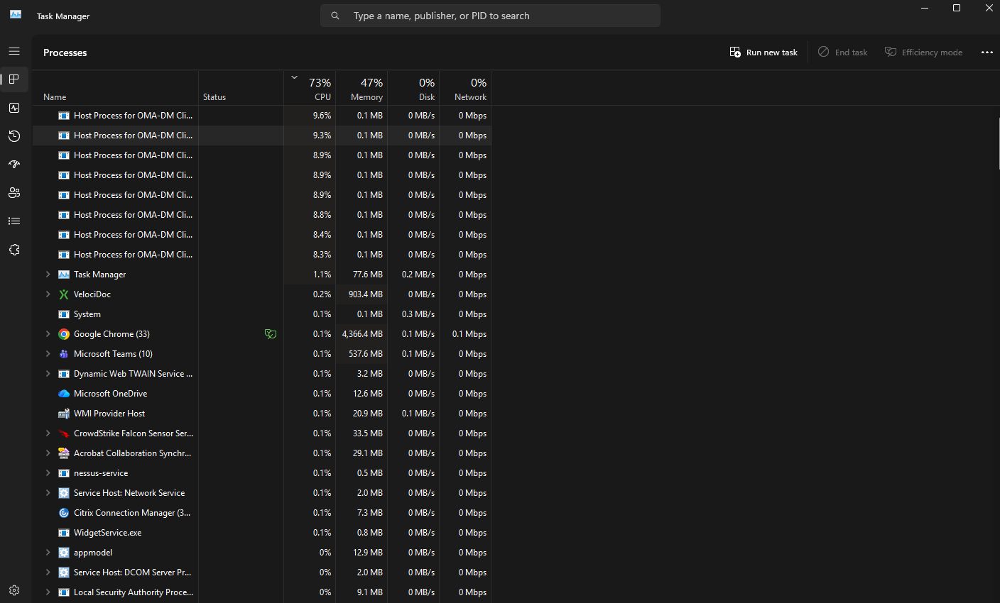
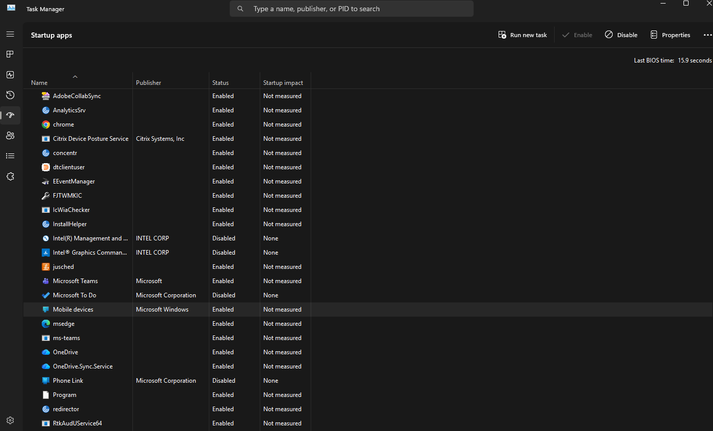
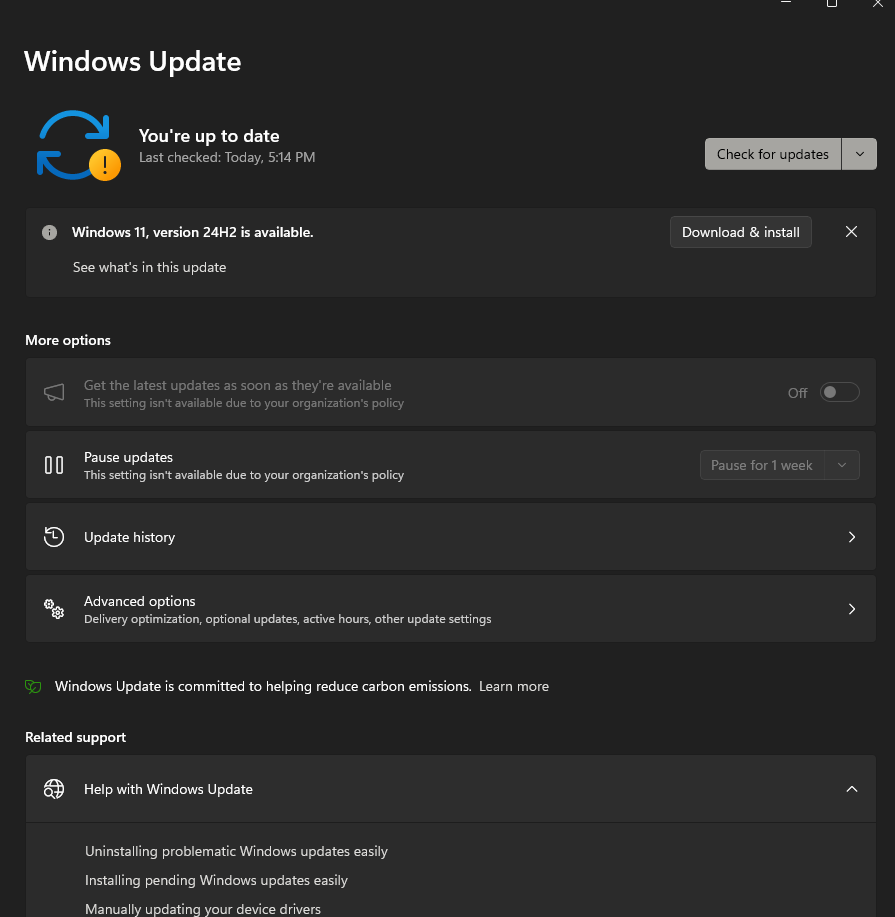

# Ticket 002 - Slow Computer Performance

## Issue

User reported that their computer was running significantly slower than normal during normal operation.

---

## Environment

- Windows 11 Pro
- Corporate Managed Workstation

---

## Symptoms

- System responsiveness was noticeably slower than expected.
- Elevated CPU utilization during normal operation.
- No user-reported application crashes or error messages.

---

## Investigation

- Contacted user.
- Obtained PC Name: UKK2201.
- Reviewed Task Manager to identify resource-intensive processes.
- Verified memory, disk, network, and GPU utilization were within normal operating ranges.
- Identified elevated CPU utilization caused by multiple **Host Process for OMA-DM Client** processes.
- Reviewed Startup Applications and identified several non-essential applications configured to launch at startup.
- Verified Windows Update status and identified a pending Windows 11 Version 24H2 feature update.
- Determined no end-user applications were the primary source of the excessive CPU utilization.
- Escalated findings to the Endpoint Management team for further investigation.

---

## Resolution

- Disabled unnecessary startup applications to reduce background activity.
- Recommended installing the pending Windows 11 Version 24H2 feature update during the next scheduled restart.
- Advised the user to continue normal operation while system performance is monitored.
- Escalated elevated OMA-DM Client CPU utilization to the Endpoint Management team for further investigation.

---

## Root Cause

Elevated CPU utilization was associated with multiple **Host Process for OMA-DM Client** processes. No evidence indicated that memory utilization, disk usage, startup applications, or pending Windows Updates were the direct cause of the reported performance issue.

---

## Evidence

### Initial Performance Review

**Before**

Observed CPU utilization averaging approximately **70–80%**, while memory, disk, network, and GPU utilization remained within expected operating ranges.

---

### Process Investigation

**Before**

Reviewed running processes and identified multiple **Host Process for OMA-DM Client** instances consuming a significant portion of CPU resources.

---

### Startup Applications

**Before**

Reviewed startup applications and identified several non-essential programs configured to launch automatically during sign-in.

---

### Windows Update Verification

**Before**

Verified Windows Update status and identified a pending **Windows 11 Version 24H2** feature update available for installation.

---

## Skills Demonstrated

- Windows 11 Administration
- Performance Troubleshooting
- Task Manager
- Startup Application Management
- Windows Update
- Resource Utilization Analysis
- Root Cause Analysis
- Escalation Procedures
- Customer Communication
- Jira Service Management
- Documentation
